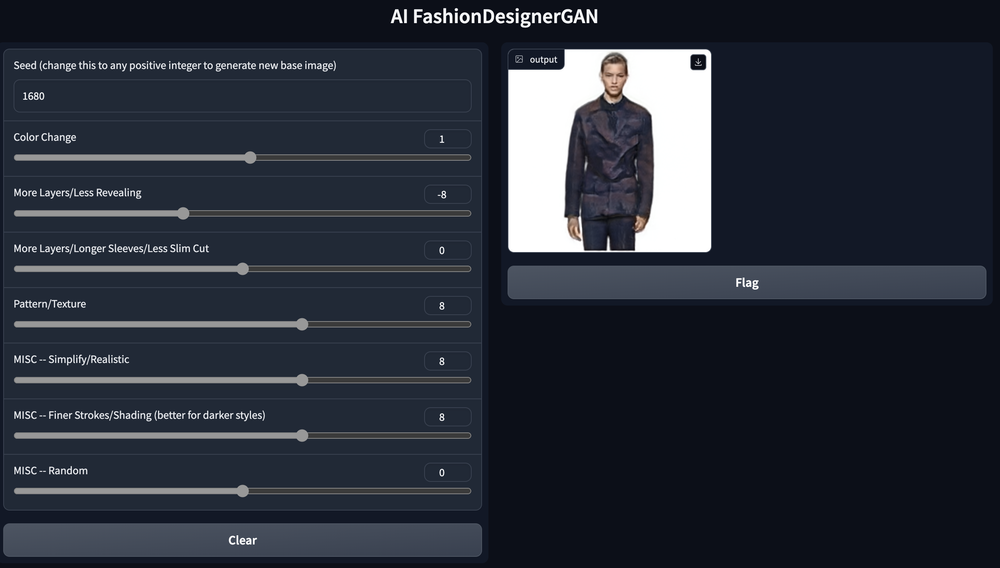

# AI-Fashion-Designer

This project trains [Nvidia's StyleGAN2](https://github.com/NVlabs/stylegan2-ada-pytorch) model from scratch on a custom dataset of fashion images to generate completely new and unique designs. The model has the ability to generate a nearly-infinite number of novel looks, while also allowing the user to adjust key aspects such as color, sleeve length, and more! The program learns from past designs from brands such as LV, Dior, Givenchy, and more over the past few years to innovate new looks and produce creative designs.

## Training

## Generation

## Customization & UI
 
Technologies Used: Python, Pytorch, Tensorflow, Keras, StyleGAN2, Neural Network, Clustering, Gradio
