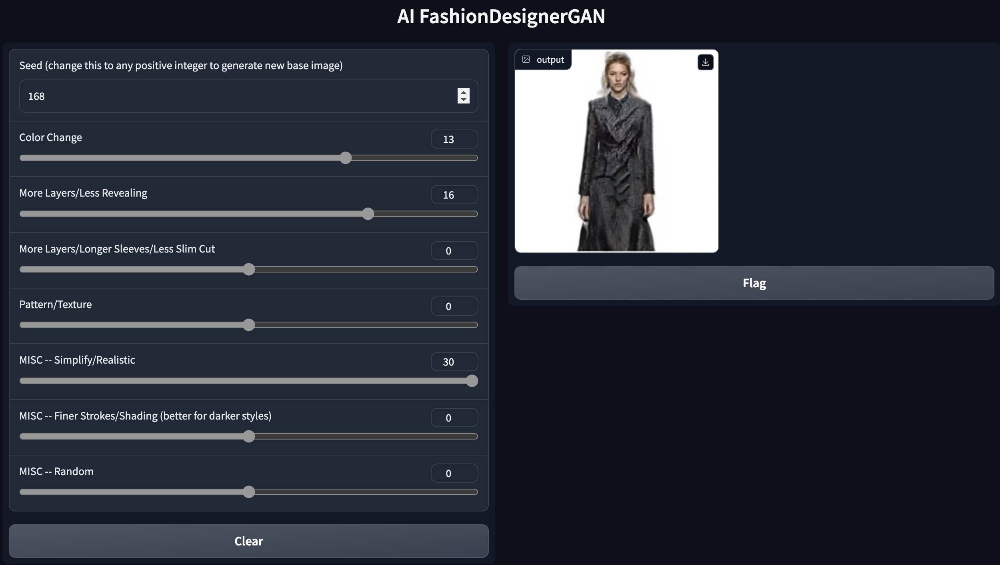

# AI-Fashion-Designer

This project trains [Nvidia's StyleGAN2](https://github.com/NVlabs/stylegan2-ada-pytorch) model from scratch on a custom dataset of fashion images to generate completely new and unique designs. The model has the ability to generate a nearly-infinite number of novel looks, while also allowing the user to adjust key aspects such as color, sleeve length, and more! The program learns from past designs from brands such as LV, Dior, Givenchy, and more over the past few years to innovate new looks and produce creative designs.

Example (See Example Image Folder for More!):

## Training - [training file](https://github.com/NaveenM12/AI-Fashion-Designer/blob/main/Fashion_SG2_ADA_PyTorch.ipynb) 
The model is trained on thousands of scraped images from [firstView fashion archives](https://firstview.com/) which are cleaned and normalized for the model inputs. The [training file](https://github.com/NaveenM12/AI-Fashion-Designer/blob/main/Fashion_SG2_ADA_PyTorch.ipynb) was run using a T4 GPU for 2 weeks then I manually chose the model instance with what I deemed to be the best fit (there is oscillating accuracy that does not singularly converge). The model produces a .pkl file that can be converted to a .pt file in the notebook for easier access and makes it easy to resume training. The procces of scraping and generating such a dataset from scratch was challenging, as was training the model and this process could surely be improved. 

## Generation - [generation file](https://github.com/NaveenM12/AI-Fashion-Designer/blob/main/Fashion_Designer_GAN.ipynb) 
Using Gradio, we are able to use the trained model to generate completely new images for different seeds. Using any positive seed entered in gradio, the model will generate new images. Note that it may take many tries to generate a good seed image as some of the images produced may not be realistic. Nevertheless, the seed is saved, so no matter if you restart the model or not, going back to the same seed in the next run will produce the same image, so if you find a suitable seed, you will be able to return to it, which is really helpful. 
The ability of this model to innovate new looks is really creative, so it may take a few tries to find a good seed, but the variety of looks is till really cool to see. Further, I think that these generations can serve as inspirations for actual looks, so even if they are not directly transferred to individual designs, I think they can be extremely valuable in sparking a new idea and helping designers.

## Customization & UI
Different tensors in the model serve to augment different features of the design. Of course some create random changes that are hard to define, but others can be seen as defining some key features (ex: sleeve length, color, layers, etc.), which can be used to change designs. Thus, we run a clustering algorithm on top of our model to identify these tensors. However, this algorithm returns 512 different clusters to explore. Only very few of these have real changes, and they required me to go through manually to determine if each one related to a tangible feature. In this project, I was only able to go through ~50 of them to identify different tensors which relate to different features. I then added these to gradio, so adjusting the sliders (as depicted in the example above), shifts the values in these tensors along a normalized curve, so that these values change and the corresponding design is adjusted. Some of the ones I selected still do not uniformly change every image, which is simply a product of having to do this manyally and only being able to go through less than 10% of all possible tensors. 

## Next Steps
Separation of Training Sets: Separating training sets into Male vs Female, Fall vs Spring, etc. would allow for better training and also more specific generations for the needs of the user. 
 
Training for Longer: Training this model for longer would help create more realistic designs, but as the model trains on the order of weeks, this is hard to do with Colab limits. 
 
More/Better customization: As explained above, if I was able to go through more of the tensors to identify how they change the designs, then there could be much more accurate and more precise customization 
 
 
Technologies Used: Python, Pytorch, Tensorflow, Keras, StyleGAN2, Neural Network, Clustering, Gradio
